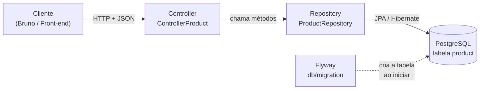
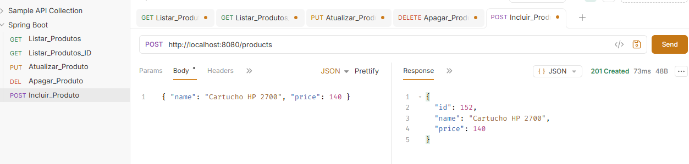
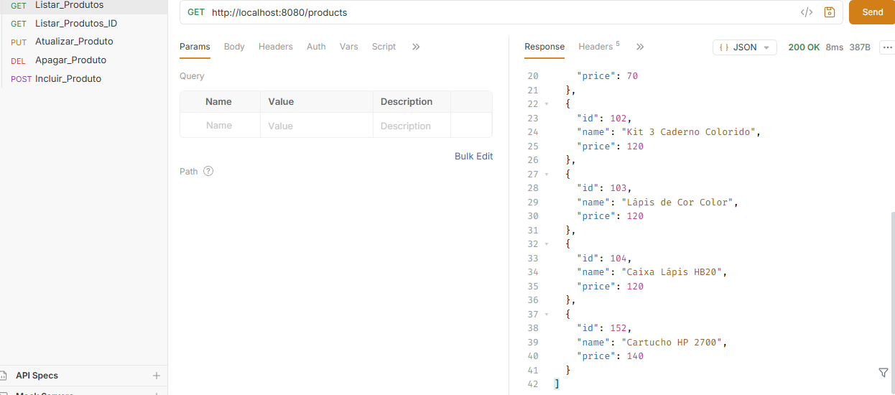
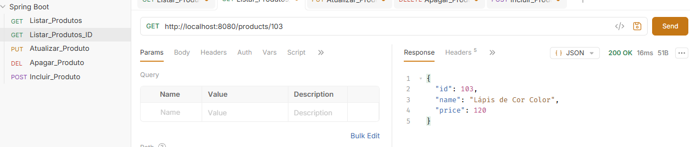
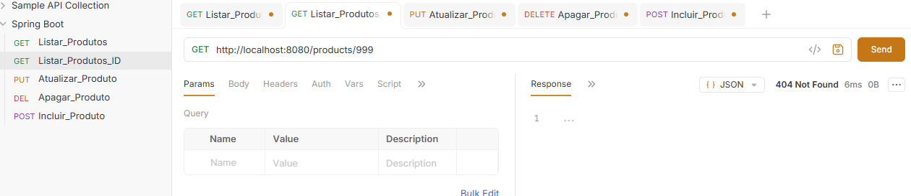
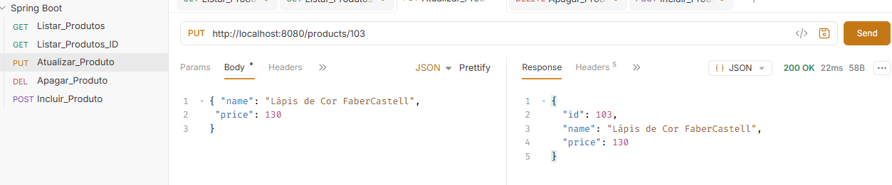
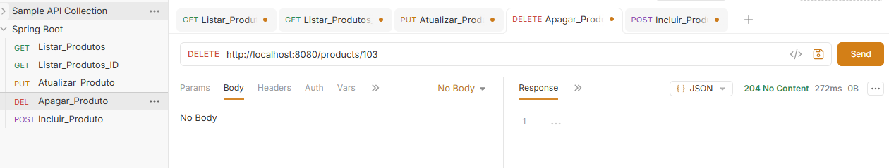
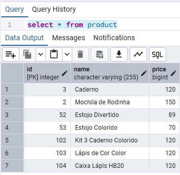

# 📦 API de Produtos — Spring Boot + PostgreSQL + Flyway


API REST para cadastro de produtos com **CRUD completo** (criar, listar, buscar, atualizar e remover), desenvolvida como meu **primeiro projeto em Java com Spring Boot**, a partir de uma videoaula do YouTube e usando o **Spring Initializr** como base.

O objetivo foi aprender, na prática, como uma aplicação Spring Boot é estruturada, como ela se conecta a um banco de dados relacional e como uma API REST deve responder usando os verbos e status HTTP corretos.

---

## 📑 Sumário

- [Tecnologias](#-tecnologias)
- [Como o projeto foi construído](#-como-o-projeto-foi-construído)
- [Arquitetura](#-arquitetura)
- [Estrutura do projeto](#-estrutura-do-projeto)
- [Modelo de dados](#-modelo-de-dados)
- [Endpoints](#-endpoints)
- [Exemplos de requisições](#-exemplos-de-requisições)
- [Comprovação dos testes](#-comprovação-dos-testes)
- [Como executar](#-como-executar)
- [Decisões técnicas](#-decisões-técnicas)
- [Problemas encontrados e soluções](#-problemas-encontrados-e-soluções)
- [O que aprendi](#-o-que-aprendi)
- [Próximos passos](#-próximos-passos)
- [Autora](#-autora)

---

## 🛠 Tecnologias

| Tecnologia | Versão | Para que foi usada |
|---|---|---|
| **Java** | 21 (LTS) | Linguagem da aplicação |
| **Spring Boot** | 4.1 | Framework base: configuração automática e servidor web embutido (Tomcat) |
| **Spring Web MVC** | — | Criação dos endpoints REST (`@RestController`, `@GetMapping`...) |
| **Spring Data JPA** | — | Acesso ao banco sem escrever SQL (`JpaRepository`) |
| **Hibernate** | — | Implementação JPA: converte objetos Java em registros do banco |
| **PostgreSQL** | — | Banco de dados relacional |
| **Flyway** | — | Versionamento do banco: cria e altera tabelas por scripts SQL |
| **Maven** | Wrapper (`mvnw`) | Gerenciamento de dependências e build |
| **Bruno** | — | Cliente HTTP usado para testar a API |

---

## 🧭 Como o projeto foi construído

Este projeto foi desenvolvido a partir de uma videoaula do YouTube (*"Como criar uma API REST com Spring Boot | Flyway e PostgreSQL"* https://www.youtube.com/watch?v=Jz1GSz4EwbM). A aula usava o **IntelliJ IDEA**; eu optei pelo **VS Code**, o que exigiu configurações extras. Algumas etapas da aula ficaram incompletas ou diferentes no meu ambiente, então registrei abaixo **todo o processo**, do computador "zerado" até a API funcionando.

### Visão geral das etapas

| # | Etapa | Ferramenta |
|---|---|---|
| 1 | Instalar o Java (JDK 21) | Eclipse Temurin |
| 2 | Preparar o editor | VS Code + extensões Java/Spring |
| 3 | Instalar o banco de dados | PostgreSQL + pgAdmin |
| 4 | Gerar o projeto | Spring Initializr |
| 5 | Abrir e organizar o projeto | VS Code |
| 6 | Configurar a conexão com o banco | `application.properties` |
| 7 | Criar a tabela | Flyway |
| 8 | Escrever o código (model, repository, controller) | Java / Spring |
| 9 | Instalar e configurar o cliente HTTP | Bruno |
| 10 | Testar a API | Bruno + pgAdmin |
| 11 | Publicar | Git + GitHub |

---

### Etapa 1 — Instalação do Java (JDK 21)

O Spring Boot 4 exige **Java 17 ou superior**. Foi escolhido o **JDK 21 (LTS)**.

1. Download do **Eclipse Temurin 21** (instalador `.msi` para Windows x64): https://adoptium.net/temurin/releases/?version=21
2. Na tela *Custom Setup* do instalador, foram marcadas as opções:
   - **Add to PATH** — permite usar o comando `java` em qualquer terminal
   - **Set JAVA_HOME variable** — usada pelo VS Code e pelo Maven para localizar o Java
3. Verificação, em um **terminal novo**:

```powershell
java -version
echo $env:JAVA_HOME
```

Resultado obtido:

```
openjdk version "21.0.12.1" 2026-08-18 LTS
OpenJDK Runtime Environment Temurin-21.0.12.1+1
```

> ⚠️ **Problema encontrado:** o primeiro teste retornou *"'java' não é reconhecido como nome de cmdlet"*. O terminal estava aberto **antes** da instalação e não tinha carregado o novo `PATH`. Bastou fechar e abrir o terminal.

---

### Etapa 2 — Preparação do VS Code

O VS Code não entende Java nem Spring "de fábrica". Foram necessários os seguintes ajustes:

**Extensões instaladas** (aba Extensões — `Ctrl+Shift+X`):

| Extensão | Publicador | Para que serve |
|---|---|---|
| [Extension Pack for Java](https://marketplace.visualstudio.com/items?itemName=vscjava.vscode-java-pack) | Microsoft | Suporte à linguagem Java, compilação, debug, Maven e testes |
| [Spring Boot Extension Pack](https://marketplace.visualstudio.com/items?itemName=vmware.vscode-boot-dev-pack) | VMware | Spring Boot Dashboard e autocomplete do `application.properties` |

**Configurações ajustadas:**

| Configuração | Onde | Por quê |
|---|---|---|
| Desmarcar **Explorer: Compact Folders** | `Ctrl+,` → buscar `compact folders` | O VS Code agrupa pastas aninhadas numa linha só (`java\com\pamela\aula1`), o que dificultava enxergar e mover os pacotes |
| Abrir a pasta que contém o `pom.xml` | *File → Open Folder* | Com a pasta "pai" aberta, a extensão Java não reconhecia o projeto corretamente |

**Comandos úteis do VS Code durante o projeto:**

| Comando / atalho | Uso |
|---|---|
| `Ctrl+Shift+P` → **Java: Clean Java Language Server Workspace** | Limpa o cache do Java quando o VS Code mostra erros que já foram corrigidos (ex.: versão do Java antiga) |
| `Ctrl+.` | Correções rápidas — usado principalmente para adicionar `import` |
| `Shift+Alt+F` | Formatar o arquivo |
| Botão direito → **Source Action → Generate Getters and Setters** | Gerar getters e setters automaticamente |

---

### Etapa 3 — Instalação do PostgreSQL

1. Download do instalador oficial: https://www.postgresql.org/download/windows/
2. Componentes instalados: **PostgreSQL Server**, **pgAdmin 4** e **Command Line Tools** (o *Stack Builder* não foi necessário).
3. Definida a senha do usuário administrador `postgres`.
4. Mantida a porta padrão **5432**.
5. No **pgAdmin**, criado o banco de dados: *Servers → PostgreSQL → Databases → botão direito → Create → Database* → nome **`product-api`**.

---

### Etapa 4 — Criação do projeto no Spring Initializr

O projeto foi gerado em https://start.spring.io com as configurações:

| Campo | Valor |
|---|---|
| Project | Maven |
| Language | Java |
| Spring Boot | 4.1.1 |
| Group | `com.pamela` |
| Artifact | `aula1` |
| Packaging | Jar |
| Java | 21 |

**Dependências selecionadas:**

| Dependência | Para que serve |
|---|---|
| Spring Web | Criar os endpoints REST e subir o servidor Tomcat |
| Spring Data JPA | Acessar o banco através de repositórios |
| PostgreSQL Driver | Conectar o Java ao PostgreSQL |
| Flyway Migration | Criar e versionar as tabelas por scripts SQL |

Após clicar em **Generate**, o `.zip` foi descompactado e aberto no VS Code.

> ⚠️ **Problema encontrado:** o `pom.xml` foi gerado com `<java.version>27</java.version>`, mas o JDK instalado era o 21. O VS Code exibia *"release 27 is not found in the system"*. Solução: alterar para `<java.version>21</java.version>` e limpar o cache do Java no VS Code.

---

### Etapa 5 — Organização do projeto

O Spring só encontra as classes que estão **dentro** de `src/main/java` e **abaixo** do pacote da classe principal. Durante o projeto, pastas criadas no lugar errado causaram `ClassNotFoundException` e `404`. A estrutura final ficou:

```
src/main/java/com/pamela/aula1/
├── Aula1Application.java      ← classe principal (gerada pelo Initializr)
├── Controller/
├── Model/
└── Repositories/
```

**Regra aprendida:** a linha `package` de cada arquivo deve corresponder exatamente ao caminho da pasta (`package com.pamela.aula1.Controller;` → pasta `com/pamela/aula1/Controller`).

> 💡 No vídeo, a classe principal se chamava `CrudApplication`. O nome é gerado a partir do campo *Artifact* do Initializr — no meu projeto, `aula1` gerou `Aula1Application`.

---

### Etapa 6 — Configuração da conexão com o banco

Arquivo `src/main/resources/application.properties`:

```properties
spring.application.name=aula1
spring.datasource.url=jdbc:postgresql://localhost:5432/product-api
spring.datasource.username=postgres
spring.datasource.password=${DB_PASSWORD}
spring.jpa.show-sql=true
```

| Propriedade | Origem do valor |
|---|---|
| `localhost` | O PostgreSQL está instalado na própria máquina |
| `5432` | Porta definida na instalação |
| `product-api` | Banco criado no pgAdmin |
| `postgres` | Usuário administrador criado na instalação |
| `${DB_PASSWORD}` | Variável de ambiente do Windows (a senha não fica no código) |
| `show-sql=true` | Exibe no console o SQL gerado pelo Hibernate — útil para aprender |

---
### Etapa 7 — Criação da tabela com Flyway

Seguindo as boas práticas, toda a estrutura do banco é criada por **scripts SQL versionados com o Flyway**, e não gerada automaticamente pelo Hibernate.

#### Por que Flyway

| Geração automática (`ddl-auto`) | Flyway (scripts versionados) |
|---|---|
| A tabela é criada "por baixo dos panos", sem registro do que foi feito | Cada alteração é um arquivo `.sql` versionado no Git |
| Não há histórico de quando nem por que o banco mudou | A tabela `flyway_schema_history` registra cada script executado, com data e checksum |
| Pode gerar estruturas diferentes entre ambientes | O mesmo script roda em todos os ambientes (desenvolvimento, homologação, produção), na mesma ordem |
| Indicada apenas para protótipos | Padrão de mercado em ambientes profissionais |

#### Como foi feito

1. Foi criado o script `src/main/resources/db/migration/V1__create-table-product.sql` (ver [Modelo de dados](#-modelo-de-dados)), com a sequência `product_seq` e a tabela `product`.
2. O `application.properties` não usa `ddl-auto`, então o Hibernate apenas lê e grava dados, sem alterar a estrutura do banco.
3. Ao iniciar a aplicação, o Flyway executou o script automaticamente:
---

### Etapa 8 — Desenvolvimento do código

| Ordem | Arquivo | O que foi feito |
|---|---|---|
| 1 | `Model/Product.java` | Entidade com `id`, `name` e `price`, anotada com `@Entity` e `@Table` |
| 2 | `Repositories/ProductRepository.java` | Interface estendendo `JpaRepository<Product, Integer>` |
| 3 | `Controller/ControllerProduct.java` | Primeiro um `GET` de teste ("Hello"), depois o CRUD completo |

---

### Etapa 9 — Instalação e configuração do Bruno

O **Bruno** é um cliente HTTP (alternativa ao Postman) usado para enviar requisições à API.

1. Download: https://www.usebruno.com/downloads
2. Criada uma **Collection** chamada **Spring Boot**.
3. Dentro dela, uma requisição salva para cada operação:

| Requisição no Bruno | Método | URL | Body |
|---|---|---|---|
| `Listar_Produtos` | GET | `http://localhost:8080/products` | — |
| `Listar_Produtos_ID` | GET | `http://localhost:8080/products/{id}` | — |
| `Incluir_Produto` | POST | `http://localhost:8080/products` | JSON |
| `Atualizar_Produto` | PUT | `http://localhost:8080/products/{id}` | JSON |
| `Apagar_Produto` | DELETE | `http://localhost:8080/products/{id}` | — |

**Como configurar uma requisição com corpo (POST/PUT):**

1. Selecionar o método (`POST` ou `PUT`) no menu à esquerda da URL.
2. Informar a URL.
3. Na aba **Body**, escolher **JSON** e colar o conteúdo, por exemplo:
   ```json
   { "name": "Caneca", "price": 25 }
   ```
4. Clicar em **Send** e conferir o status no canto superior da resposta.
5. Salvar com `Ctrl+S` para reutilizar depois.

---

### Etapa 10 — Testes

Com a aplicação rodando (`.\mvnw spring-boot:run`), cada requisição do Bruno foi executada e o resultado conferido no **pgAdmin** (*tabela product → View/Edit Data → All Rows*). Os resultados estão em [Comprovação dos testes](#-comprovação-dos-testes).

---

### Etapa 11 — Publicação no GitHub

```powershell
git init
git add .
git commit -m "Primeiro projeto: API REST de produtos com Spring Boot, JPA, PostgreSQL e Flyway"
git branch -M main
git remote add origin https://github.com/Banguela88/spring-boot-product-api.git
git push -u origin main
```

Antes do primeiro commit, a senha do banco foi retirada do `application.properties` e substituída pela variável `${DB_PASSWORD}`, e foi conferido com `git status` que pastas como `target/` e `.vscode/` estavam fora do envio (via `.gitignore`).

---

## 🏗 Arquitetura

A aplicação segue a arquitetura em camadas, em que cada camada tem uma responsabilidade:



| Camada | Classe | Responsabilidade |
|---|---|---|
| **Controller** | `ControllerProduct` | Recebe as requisições HTTP, chama o repositório e devolve a resposta com o status correto |
| **Model** | `Product` | Representa um produto. Anotada com `@Entity`, é mapeada para a tabela `product` |
| **Repository** | `ProductRepository` | Interface que estende `JpaRepository`. O Spring gera a implementação automaticamente (`findAll`, `findById`, `save`, `deleteById`...) |
| **Migration** | `V1__create-table-product.sql` | Script versionado que cria a tabela e a sequência no banco |

---

## 📁 Estrutura do projeto

```
spring-boot-product-api/
├── pom.xml                                   # dependências (Maven)
├── mvnw / mvnw.cmd                           # Maven Wrapper (não precisa instalar o Maven)
└── src/main/
    ├── java/com/pamela/aula1/
    │   ├── Aula1Application.java             # classe principal (@SpringBootApplication)
    │   ├── Controller/
    │   │   └── ControllerProduct.java        # endpoints REST
    │   ├── Model/
    │   │   └── Product.java                  # entidade JPA
    │   └── Repositories/
    │       └── ProductRepository.java        # acesso ao banco
    └── resources/
        ├── application.properties            # configuração (banco, JPA)
        └── db/migration/
            └── V1__create-table-product.sql  # script do Flyway
```

---

## 🗄 Modelo de dados

### Entidade `Product` → tabela `product`

| Campo Java | Tipo Java | Coluna | Tipo PostgreSQL | Regras |
|---|---|---|---|---|
| `id` | `Integer` | `id` | `INTEGER` | Chave primária, gerada automaticamente |
| `name` | `String` | `name` | `VARCHAR(255)` | Obrigatório |
| `price` | `long` | `price` | `BIGINT` | Obrigatório |

### Script de criação (Flyway)

```sql
-- Sequência usada pelo @GeneratedValue(strategy = GenerationType.AUTO)
CREATE SEQUENCE product_seq START WITH 1 INCREMENT BY 50;

CREATE TABLE product (
    id     INTEGER      NOT NULL PRIMARY KEY,
    name   VARCHAR(255) NOT NULL,
    price  BIGINT       NOT NULL
);
```

Ao iniciar a aplicação, o Flyway executa os scripts pendentes da pasta `db/migration` e registra cada execução na tabela `flyway_schema_history`.

---

## 🔗 Endpoints

URL base: `http://localhost:8080`

| Operação | Método | Rota | Corpo (JSON) | Sucesso | Erro |
|---|---|---|---|---|---|
| Listar todos | `GET` | `/products` | — | `200 OK` | — |
| Buscar por id | `GET` | `/products/{id}` | — | `200 OK` | `404 Not Found` |
| Criar | `POST` | `/products` | `name`, `price` | `201 Created` | — |
| Atualizar | `PUT` | `/products/{id}` | `name`, `price` | `200 OK` | `404 Not Found` |
| Remover | `DELETE` | `/products/{id}` | — | `204 No Content` | `404 Not Found` |

### Significado dos status HTTP usados

| Status | Nome | Quando a API devolve |
|---|---|---|
| `200` | OK | A operação deu certo e há conteúdo na resposta |
| `201` | Created | Um produto novo foi criado |
| `204` | No Content | O produto foi removido; não há conteúdo para devolver |
| `404` | Not Found | Não existe produto com o id informado |
| `500` | Internal Server Error | Erro inesperado no servidor (detalhes ficam no log da aplicação) |

---

## 📬 Exemplos de requisições

Os exemplos abaixo reproduzem os testes feitos no **Bruno**. Os ids podem variar conforme os dados do seu banco.

### 1. Criar produto — `POST /products`

**Requisição**

```http
POST http://localhost:8080/products
Content-Type: application/json

{
  "name": "Caneca",
  "price": 25
}
```

**Resposta — `201 Created`**

```json
{
  "id": 1,
  "name": "Caneca",
  "price": 25
}
```

> O `id` não é enviado: ele é gerado pelo banco.

---

### 2. Listar produtos — `GET /products`

**Requisição**

```http
GET http://localhost:8080/products
```

**Resposta — `200 OK`**

```json
[
  {
    "id": 1,
    "name": "Caneca",
    "price": 25
  },
  {
    "id": 2,
    "name": "Camiseta",
    "price": 60
  }
]
```

> Com o banco vazio, a resposta é uma lista vazia: `[]`.

---

### 3. Buscar por id — `GET /products/{id}`

**Requisição (id existente)**

```http
GET http://localhost:8080/products/1
```

**Resposta — `200 OK`**

```json
{
  "id": 1,
  "name": "Caneca",
  "price": 25
}
```

**Requisição (id inexistente)**

```http
GET http://localhost:8080/products/9999
```

**Resposta — `404 Not Found`** (sem corpo)

---

### 4. Atualizar produto — `PUT /products/{id}`

**Requisição**

```http
PUT http://localhost:8080/products/1
Content-Type: application/json

{
  "name": "Caneca Personalizada",
  "price": 35
}
```

**Resposta — `200 OK`**

```json
{
  "id": 1,
  "name": "Caneca Personalizada",
  "price": 35
}
```

> Se o id não existir, a resposta é `404 Not Found`.

---

### 5. Remover produto — `DELETE /products/{id}`

**Requisição**

```http
DELETE http://localhost:8080/products/1
```

**Resposta — `204 No Content`** (sem corpo)

> Repetindo a mesma requisição, a resposta passa a ser `404 Not Found`, porque o produto já foi removido.

---

### Os mesmos testes pelo PowerShell (sem o Bruno)

```powershell
# Criar
Invoke-RestMethod -Method Post -Uri http://localhost:8080/products `
  -ContentType "application/json" -Body '{"name": "Caneca", "price": 25}'

# Listar
Invoke-RestMethod http://localhost:8080/products

# Buscar por id
Invoke-RestMethod http://localhost:8080/products/1

# Atualizar
Invoke-RestMethod -Method Put -Uri http://localhost:8080/products/1 `
  -ContentType "application/json" -Body '{"name": "Caneca Personalizada", "price": 35}'

# Remover
Invoke-RestMethod -Method Delete -Uri http://localhost:8080/products/1
```

---

## ✅ Comprovação dos testes

Testes manuais executados no **Bruno**, cobrindo os cenários de sucesso e de erro de cada endpoint. Os ids refletem os dados reais do banco no momento dos testes.

| # | Cenário | Método | Rota | Corpo enviado | Status esperado | Status obtido | Resultado |
|---|---|---|---|---|---|---|---|
| 1 | Criar produto | `POST` | `/products` | `{"name":"Cartucho HP 2700","price":140}` | `201` | `201 Created` (id `152` gerado) | ✅ |
| 2 | Listar produtos | `GET` | `/products` | — | `200` + lista | `200 OK` + lista com o produto criado | ✅ |
| 3 | Buscar id existente | `GET` | `/products/103` | — | `200` | `200 OK` | ✅ |
| 4 | Buscar id inexistente | `GET` | `/products/999` | — | `404` | `404 Not Found` | ✅ |
| 5 | Atualizar produto | `PUT` | `/products/103` | `{"name":"Lápis de Cor FaberCastell","price":130}` | `200` | `200 OK` com os dados alterados | ✅ |
| 6 | Remover produto | `DELETE` | `/products/103` | — | `204` | `204 No Content` | ✅ |
| 7 | Conferir dados no banco | SQL | `select * from product` | — | Registros gravados | Registros listados no pgAdmin | ✅ |

### Evidências

#### 1. Criar produto — `POST /products` → `201 Created`


#### 2. Listar produtos — `GET /products` → `200 OK`


#### 3. Buscar por id — `GET /products/103` → `200 OK`


#### 4. Buscar id inexistente — `GET /products/999` → `404 Not Found`


#### 5. Atualizar produto — `PUT /products/103` → `200 OK`


#### 6. Remover produto — `DELETE /products/103` → `204 No Content`


#### 7. Dados gravados no PostgreSQL (pgAdmin)


---

## ▶ Como executar

### Pré-requisitos

| Ferramenta | Download |
|---|---|
| JDK 21 | https://adoptium.net/temurin/releases/?version=21 |
| PostgreSQL + pgAdmin | https://www.postgresql.org/download/ |
| Bruno (opcional, para testes) | https://www.usebruno.com/downloads |

### 1. Clonar o repositório

```powershell
git clone https://github.com/Banguela88/spring-boot-product-api.git
cd spring-boot-product-api
```

### 2. Criar o banco de dados

No pgAdmin (ou no `psql`):

```sql
CREATE DATABASE "product-api";
```

As tabelas **não** precisam ser criadas manualmente: o Flyway faz isso na primeira execução.

### 3. Configurar a senha do banco

Por segurança, a senha **não fica no código**. O `application.properties` lê a variável de ambiente `DB_PASSWORD`:

```properties
spring.datasource.url=jdbc:postgresql://localhost:5432/product-api
spring.datasource.username=postgres
spring.datasource.password=${DB_PASSWORD}
```

Crie a variável no Windows (PowerShell):

```powershell
[Environment]::SetEnvironmentVariable("DB_PASSWORD", "sua_senha", "User")
```

Depois, **feche e abra o terminal** para a variável ser carregada.

### 4. Rodar a aplicação

```powershell
.\mvnw spring-boot:run
```

A aplicação está no ar quando o console mostrar:

```
Successfully applied 1 migration to schema "public"
Tomcat started on port 8080 (http)
Started Aula1Application in X seconds
```

A API fica disponível em **http://localhost:8080/products**.


## 🐞 Problemas encontrados e soluções

Registro dos erros enfrentados durante o desenvolvimento e de como foram diagnosticados.

| Erro | Causa | Solução |
|---|---|---|
| `'java' não é reconhecido como comando` | Terminal aberto antes da instalação do JDK | Abrir um novo terminal para carregar o `PATH` |
| `release 27 is not found in the system` | `pom.xml` pedia Java 27, mas o JDK instalado era o 21 | Ajustar `<java.version>21</java.version>` |
| `ClassNotFoundException: Aula1Application` | Classes fora de `src/main/java` não eram compiladas | Reorganizar os pacotes dentro de `src/main/java/com/pamela/aula1` |
| `The declared package does not match the expected package` | Linha `package` diferente da pasta do arquivo | Alinhar o `package` com o caminho da pasta |
| `Port 8080 was already in use` | Outra instância da aplicação já estava rodando | Encerrar o processo anterior |
| `404` em `/products` | Método do controller sem `@GetMapping` | Adicionar a anotação do verbo HTTP |
| `500` em `/products/1` | `{id}` na rota e `Id` no parâmetro (o Java diferencia maiúsculas) | Usar o mesmo nome: `@PathVariable Integer id` |
| `missing return statement` | Um caminho do método terminava sem `return` | Garantir `return` em todos os caminhos |

**Método de diagnóstico adotado:** identificar a fase do erro (ambiente, compilação ou execução) → ler o tipo da exceção → localizar a causa raiz (último `Caused by:` no log) → verificar o que mudou desde a última execução bem-sucedida.

---

## 📚 O que aprendi

- Estrutura de um projeto Spring Boot e o papel de cada camada (controller, model, repository)
- Mapeamento objeto-relacional com JPA/Hibernate (`@Entity`, `@Id`, `@GeneratedValue`)
- Injeção de dependência com `@Autowired`
- Diferença entre **tipo** e **variável** e as convenções de nomenclatura do Java
- Verbos HTTP (`GET`, `POST`, `PUT`, `DELETE`) e status codes de uma API REST
- Versionamento de banco de dados com Flyway
- Configuração segura de credenciais com variáveis de ambiente
- Leitura de stack traces e diagnóstico de erros
- Versionamento de código com Git e publicação no GitHub

---

## 🚀 Próximos passos

- [ ] Validação dos dados de entrada (`@Valid`, `@NotBlank`, `@Positive`)
- [ ] Usar DTOs para separar o modelo do banco do contrato da API
- [ ] Tratamento global de erros com `@ControllerAdvice`
- [ ] Documentação interativa com Swagger / OpenAPI
- [ ] Testes automatizados (JUnit + MockMvc)
- [ ] Usar `BigDecimal` para valores monetários
- [ ] Executar o banco com Docker

---

## 👩‍💻 Autora

**Pamela** — Especialista em sustentação de sistemas do mercado financeiro (boleto, DDA e infraestruturas de mercado).

Minha rotina é investigar incidentes, analisar cenários de erro e fazer a ponte entre clientes e desenvolvimento. Venho do Delphi e do C#, e estou aprendendo **Java e Spring Boot** para entender como as aplicações que eu sustento funcionam por dentro, da configuração ao log de erro, e dar suporte com mais profundidade técnica.

[](https://www.linkedin.com/in/pamela-souza-core-banking/)
[](https://github.com/Banguela88)